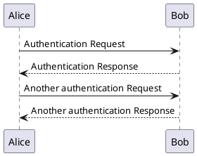

---
# Using a layout from the Minimal Mistakes theme
layout: single
title: Jekyll Spaceship Features
author_profile: false # Hides the author sidebar for a cleaner look on this page
---

# Jekyll Spaceship Showcase

This page demonstrates some of the awesome features of the `jekyll-spaceship` plugin integrated with the Minimal Mistakes theme.

## 1. Table of Contents

The table of contents below is automatically generated by jekyll-spaceship.

<!--toc-->

## 2. MathJax Support

You can write LaTeX math equations, and they will be rendered beautifully.

Inline math: $E = mc^2$

Display math:

$$
\sum_{i=1}^{n} i = \frac{n(n+1)}{2}
$$

## 3. PlantUML Diagrams

Create diagrams from plain text.

## 4. Mermaid.js Diagrams

Mermaid is another great way to create diagrams. The theme includes support for this.

## 5. Embedded Media

Easily embed videos from YouTube or Vimeo.

`@[youtube](https://www.youtube.com/watch?v=dQw4w9WgXcQ)`

`@[vimeo](https://vimeo.com/545102032)`

## 6. Emojis

Use emojis in your content! :tada: :rocket:

This is automatically handled, just use the standard emoji shortcodes.
